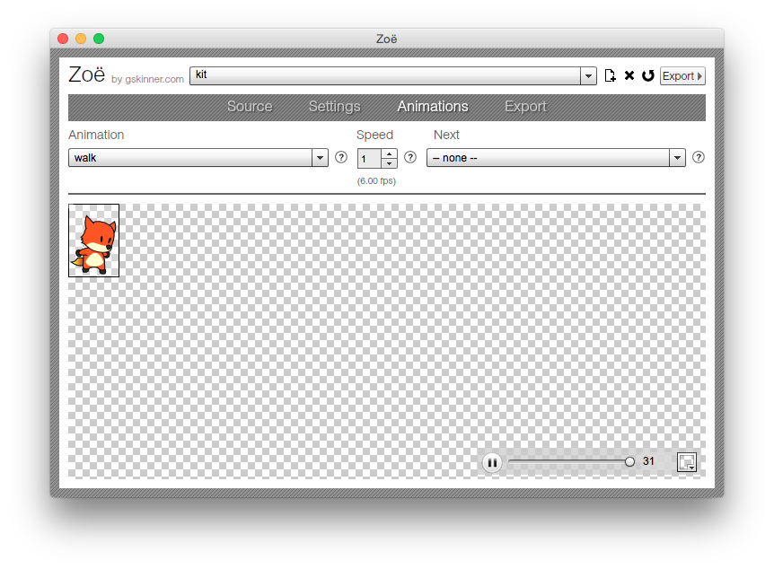
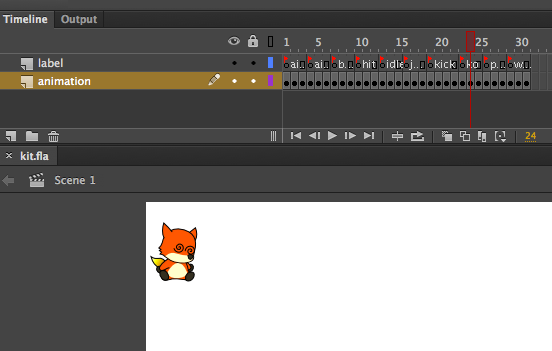

# ZoeImporter Spritesheet Example

This example is based on Infinite's code
[texturepacker example](https://github.com/jgranick/spritesheet/tree/master/examples/texturepacker)

* Artwork is from opengameart.org [link](http://opengameart.org/content/kit-the-firefox-mascot)

## Zoe

If Flash is still your favourite animation tool, you should use [ZoeImporter](https://github.com/jgranick/spritesheet/blob/master/spritesheet/importers/ZoeImporter.hx) to create spritesheets.

You will need [Zoe](http://www.createjs.com/#!/Zoe) 

>
ZOË   
An AIR application for exporting SWF animations as EaselJS spritesheets for use in Canvas and CSS. Maintain frame labels, reuse similar frames, and more!
>

## Flash

And create an animation on the timeline with labels

Export the animation to `.swf` and open that file into Zoe.

Fiddle with the settings in Zoe and export the spritesheet with json.

